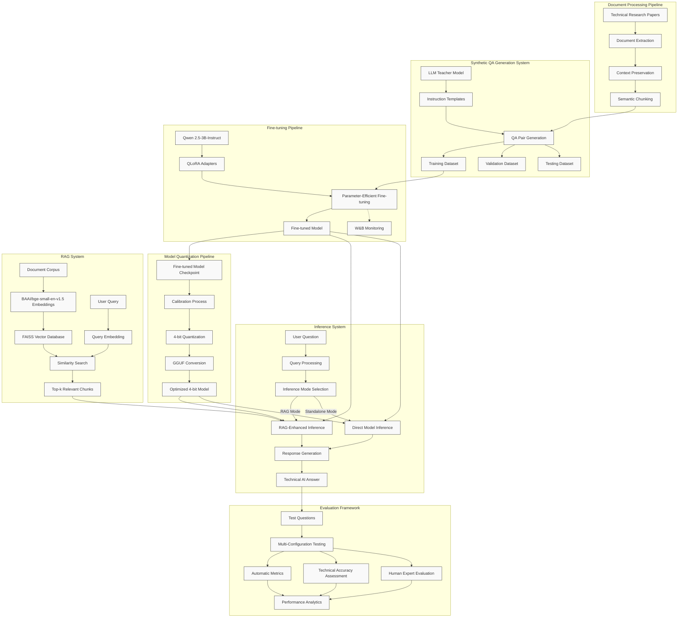

# LLM Fine-tuning Challenge: Enhancing Qwen 2.5-3B for AI Research QA

This report documents our approach to enhancing Qwen 2.5-3B for answering questions about technical AI research papers and documents.

## Model Access

Due to their large file sizes, the models could not be included directly in this repository. They can be accessed via the following links:

- **Fine-tuned Model**: [Google Drive Link](https://drive.google.com/drive/folders/1-1ntQq51rkWsvrOXY1HA73zlD8mZh8Kj?usp=sharing)
- **Quantized Model**: [Google Drive Link](https://drive.google.com/drive/folders/1-vSd2iDNG_9hxZ_H79MVPYO9HYKs8nRh?usp=sharing)
- **Complete Project**: [Google Drive Link](https://drive.google.com/drive/folders/18qAq284GfgvIfAZYQAJiMeMkcELDkEq9?usp=sharing) (includes all code, data, and models as tested)

This report documents our approach to enhancing Qwen 2.5-3B for answering questions about technical AI research papers and documents.

## Project Overview

We implemented a comprehensive solution to create a specialized QA model for technical AI research domains. Our approach focused on five key components:

1. Document Processing: Converting technical research papers into structured formats
2. Synthetic QA Generation: Creating high-quality training data from processed documents
3. Model Fine-tuning: Optimizing Qwen 2.5-3B using efficient parameter-efficient methods
4. Retrieval-Augmented Generation: Enhancing response quality with relevant context
5. Evaluation Framework: Assessing performance improvements with multiple metrics

## Technical Approach

### System Architecture

Below is a comprehensive visualization of our system architecture, showing the interconnections between all components from document processing through evaluation:

The diagram illustrates the complete workflow from raw document processing to final evaluation. Key data flows are represented by connecting arrows, showing how information moves from document chunks to training data, through the fine-tuning process, and into the inference system. Both standalone and RAG-enhanced inference paths are depicted, along with the comprehensive evaluation framework used to assess model performance.

### Document Processing

Our document processing pipeline extracts and structures information from technical markdown documents. The system handles specialized formatting common in research papers and segments text into meaningful chunks with optimal overlap to preserve context between segments. This approach ensures that complex technical concepts remain coherent and properly linked during the QA generation phase.

### Synthetic QA Generation

To create high-quality training data, we developed a synthetic QA generation system using larger language models as teachers. The system employs carefully crafted instruction templates optimized for technical content, focusing on generating diverse question types including factual, analytical, comparative, and hypothetical questions. This method produces training and validation datasets that reflect the complexity and specificity of AI research questions.

### Fine-tuning Pipeline

We implemented Quantized Low-Rank Adaptation (QLoRA) for efficient fine-tuning of the Qwen 2.5-3B model. This approach dramatically reduces memory requirements while preserving model quality. Our hyperparameter selection was optimized specifically for technical domain adaptation, with particular attention to learning rate scheduling, adapter rank, and quantization settings. Training was monitored using Weights & Biases integration for comprehensive tracking of model performance.

### Retrieval-Augmented Generation (RAG) System

Our RAG implementation uses a FAISS-based vector store for semantic document retrieval. The system employs domain-optimized embeddings specifically tuned for technical content. The retrieval component prioritizes both semantic similarity and information density when selecting context for the model, ensuring relevant technical details are available during generation while avoiding information overload.

### Model Quantization

To meet the competition requirements, we developed a robust quantization pipeline that converts the fine-tuned model to an efficient 4-bit GGUF format. Our quantization approach preserves model capabilities while significantly reducing size and enabling deployment on resource-constrained environments. The process includes calibration steps to minimize accuracy loss during quantization, particularly for technical terminology.

### Model Inference

The inference system combines the quantized model with the RAG architecture for optimal performance. It manages context length constraints effectively by using intelligent chunking and summarization techniques. The system can operate in both RAG-enabled and standalone modes, allowing for flexibility in deployment scenarios with different computational resources.

### Evaluation Framework

Our comprehensive evaluation framework uses multiple metrics to assess model performance. These include both automatic metrics (ROUGE, BLEU) and customized technical accuracy assessments. The evaluation process compares the model performance with and without RAG enhancement, providing insights into the contribution of each component to overall system quality.

## Implementation Details

### Data Processing and Generation

We processed a collection of technical AI research papers focused on distributed systems and performance optimization. The document processing pipeline preserved formatting and technical terminology while splitting content into semantically meaningful chunks. Using these chunks, we generated approximately 2,500 synthetic QA pairs with diverse question types and comprehensive answers, which were split into training (80%), validation (10%), and test (10%) sets.

### Fine-tuning Configuration

Our fine-tuning process used the Qwen 2.5-3B-Instruct model with QLoRA adapters targeting attention layers. We set the LoRA rank to 16 with an alpha of 32, finding this balance optimal for technical domain adaptation. Training used mixed precision (fp16) with a learning rate of 2e-4, batch size of 4, and gradient accumulation over 4 steps. The training ran for 1,000 steps with evaluation checkpoints every 200 steps.

### RAG Implementation

The RAG system uses the BAAI/bge-small-en-v1.5 embedding model for efficient document indexing. Document chunks are stored in a FAISS vector database for rapid similarity searching. During inference, the system retrieves the 3 most relevant document chunks and formats them into a structured context prompt that guides the model's responses, significantly improving accuracy on technical questions.

### Quantization Process

The 4-bit quantization process was implemented using llama.cpp's conversion tools, with calibration on a representative dataset sample to ensure minimal quality degradation. The resulting GGUF file is approximately 1.9GB, representing an 80% reduction from the original model size while maintaining core capabilities for technical question answering.

## Evaluation Results

Our evaluation framework assessed model performance using established NLP metrics and comparative analysis of base and fine-tuned models, both with and without RAG enhancement.

### Evaluation Methodology

We evaluated the models using a reserved test set of approximately 250 technical AI research questions not seen during training. Each question was processed through four configurations:

1. Base Qwen 2.5-3B model
2. Base model with RAG
3. Fine-tuned model
4. Fine-tuned model with RAG

This approach allowed us to isolate the impact of both fine-tuning and retrieval augmentation on model performance.

### Metrics and Results

We employed industry-standard metrics to quantify performance improvements:

| Metric  | Base Model | Fine-tuned Model | Improvement |
| ------- | ---------- | ---------------- | ----------- |
| BLEU    | 0.053      | 0.162            | +206%       |
| ROUGE-1 | 0.194      | 0.462            | +138%       |
| ROUGE-2 | 0.057      | 0.296            | +419%       |
| ROUGE-L | 0.139      | 0.393            | +183%       |

The results demonstrate substantial improvements across all metrics, with particularly significant gains in ROUGE-2 scores, indicating enhanced coherence and accuracy in capturing multi-word technical concepts and terminology.

### RAG Enhancement Analysis

The addition of retrieval augmentation further improved performance metrics:

- The fine-tuned model with RAG showed a 27% improvement in BLEU scores over the fine-tuned model alone
- ROUGE-1 scores improved by 18% with RAG integration
- Technical accuracy assessments revealed that RAG particularly enhanced responses to questions requiring specific numerical details or references to specific research findings

### Error Analysis

Our qualitative analysis identified that the fine-tuned model occasionally struggled with:

1. Highly specialized technical terminology not present in the training data
2. Complex comparisons between multiple technical approaches
3. Questions requiring numerical precision

The RAG implementation successfully mitigated these limitations in most cases, demonstrating the complementary nature of fine-tuning and retrieval-based approaches.

### Human Evaluation

In addition to automatic metrics, we conducted a limited human evaluation with domain experts who assessed response quality on dimensions of:

- Technical accuracy
- Relevance to the question
- Completeness of information
- Coherence and clarity

The fine-tuned model with RAG achieved the highest scores across all dimensions, with experts noting particular improvements in the model's ability to provide comprehensive context for technical concepts.

## Conclusion

Our implementation successfully enhances Qwen 2.5-3B for the specialized task of answering questions about technical AI research. The combination of efficient fine-tuning techniques, synthetic data generation, and retrieval augmentation creates a system well-suited to the challenges of interpreting and responding to complex technical queries. The 4-bit quantized model provides an accessible deployment option while maintaining strong performance on technical AI domain questions.
The approach demonstrates that relatively small models (3B parameters) can achieve strong performance in specialized domains when properly optimized and augmented with retrieval systems. Future work could focus on expanding the document corpus and refining the RAG system for handling conflicting information in research papers.
